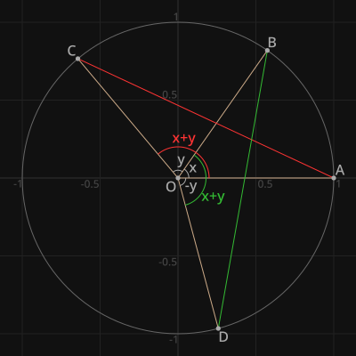

# mathdiagrams

**This is a Python package to create diagrams for mathematical proofs**

Here is an example of the generated image:

It is often difficult to draw diagrams with the default context provided by the SVG-canvas libraries.
Following are the main issues we came across.

- Default origin is at the top left
- Y axis is reversed
- Most of the math diagrams needs scaling (we often need something like 1unit = 300px)
    - Scaling of the default context also changes font size, line width, etc
- X,Y co-ordinates are split (eg: someShape(x1, y1, x2, y2) instead of someShape(p1, p2))

This library aims to fix (some) of the above issues.

- Provides a natural context for drawing
    - Default origin is the center. It is also easy to change this
    - Y axis has the normal direction
- Global scaling is easy to configure and it does not change other things like font-size
- X,Y co-ordinates are combined as we are using complex type for points
    - We get vector arithmetic, rotation, type-support, etc for free

Additionally, this library provides the following features:

- Supports hex color codes (eg: `#AB3`) 
- Supports method chaining (eg: `ctx.set_color("#123").line(p1, p2)`)
- A graph paper line grid

## Dependencies

See requirements.txt for dependencies. We use pycairo underneath for drawing.
It seems to require the following Debian packages when installing: libcairo2 libcairo2-dev

